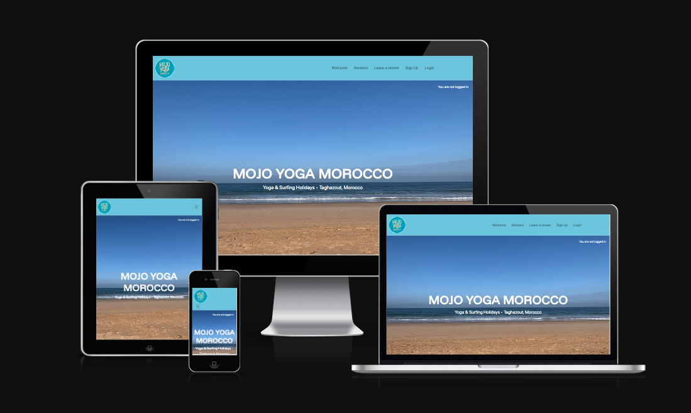
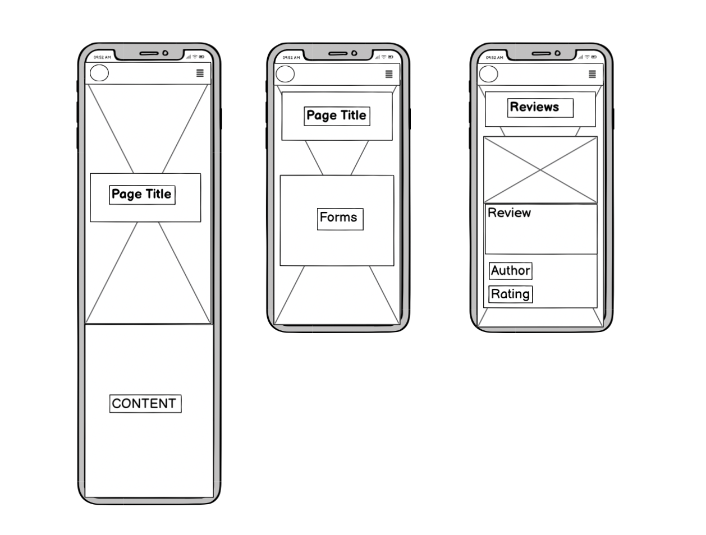
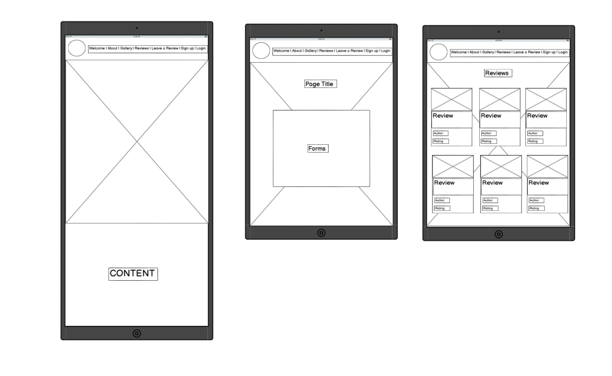
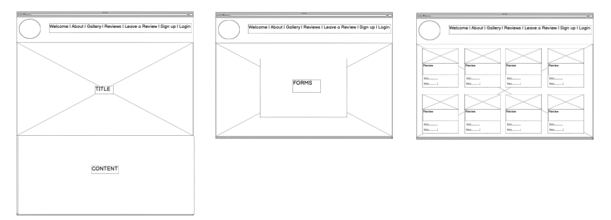

# MojoYoga

## Introduction 

MojoYoga is a website designed for people who have been on a surf and yoga retreat to leave a photo and review of their experience. Mojo yoga has been developed for my final project of Code Institute's Full-Stack Developer Bootcamp - This project focuses on Django and Bootstrap frameworks, Database manipulation and CRUD (Create, Read, Update and Delete) functionality. It is for educational purposes only.

Live site: [MojoYoga](https://mojoyoga-f4267f7b0b57.herokuapp.com/)

## Table of Contents

- [MojoYoga](#MojoYoga)
  - [Introduction](#introduction)
  - [Table of Contents](#table-of-contents)
  - [Overview](#overview)
- [UX - User Experience](#ux---user-experience)
  - [Design Inspiration](#design-inspiration)
    - [Colour Scheme](#colour-scheme)
    - [Font](#font)
- [Project Planning](#project-planning)
  - [Strategy Plane](#strategy-plane)
    - [Site Goals](#site-goals)
  - [Agile Methodologies - Project Management](#agile-methodologies---project-management)
    - [MoSCoW Prioritization](#moscow-prioritization)
    - [Sprints](#sprints)
  - [User Stories](#user-stories)
    - [Visitor User Stories](#visitor-user-stories)
    - [Epic - User Profile](#epic---user-profile)
    - [Epic - Articles](#epic---articles)
    - [Epic - Booking](#epic---booking)
    - [Epic - Photo Gallery](#epic---photo-gallery)
    - [Epic - Visit Us/Reviews](#epic---visit-usreviews)
  - [Scope Plane](#scope-plane)
  - [Structural Plane](#structural-plane)
  - [Skeleton \& Surface Planes](#skeleton--surface-planes)
    - [Wireframes](#wireframes)
    - [Database Schema - Entity Relationship Diagram](#database-schema---entity-relationship-diagram)
    - [Security](#security)
- [Features](#features)
  - [User View - Registered/Unregistered](#user-view---registeredunregistered)
  - [CRUD Functionality](#crud-functionality)
  - [Feature Showcase](#feature-showcase)
  - [Future Features](#future-features)
- [Technologies \& Languages Used](#technologies--languages-used)
  - [Libraries \& Frameworks](#libraries--frameworks)
  - [Tools \& Programs](#tools--programs)
- [Testing](#testing)
- [Deployment](#deployment)
  - [Connecting to GitHub](#connecting-to-github)
  - [Django Project Setup](#django-project-setup)
  - [Cloudinary API](#cloudinary-api)
  - [Elephant SQL](#elephant-sql)
  - [Heroku deployment](#heroku-deployment)
  - [Clone project](#clone-project)
  - [Fork Project](#fork-project)
- [Credits](#credits)
  - [Code](#code)
  - [Media](#media)
    - [Additional reading/tutorials/books/blogs](#additional-readingtutorialsbooksblogs)
  - [Acknowledgements](#acknowledgements)

## Overview

MojoYoga is a surf and yoga retreat review site with details about various retreats and the retreat owners storys. Users have the option to:

- Sign up and create an account
- Leave a review with 0-5 star rating
- Optionally add a photo to their review
- Update (Edit) or Delete their review
- View others reviews
- Learn about surf and yoga retreats

Mojo Yoga has full responsiveness on different screen sizes and is accessible on all screensizes. It is desgned to add another element to help the retreat gain traction and interest by allowing users of the site to see reviews.

# UX - User Experience

## Desgin Inspiration

I was always excited to work on a full stack project from the moment I enrolled in the course, throughout the course my idea for the Capstone project changed many times. I initally wanted to create a JavaScript game with leadersboards and profiles, however as each project went by I realised that creating a functional MVP should always come first and due to time restraints it may put too much pressure on myself. Having gone through the walkthrough project in the course in which I made a blog site it gave me the inspiration of creating a new element to my mothers website - A page dedicated to reviews and somewhere to sign up and make an account. Whilst adding my own touch and having permission to use this site as a base I knew this would be perfect to practice my HTML, CSS and JS skills whilst adding CRUD functionality to create a full stack app and take some pressure off with finding a other sites for inspiration.

Joanna and Mohammed's Website: [MojoYogaMorocco](https://www.mojoyogamorocco.com/)

### Colour Scheme

Having access to a logo and website that already works very well I used these colours as a basis to choose my colours. Being a surf and yoga retreat; blue and calming colours were always a must have and I wanted a focus on the photos that people would upload. One of the photos from Morocco adds the perfect hero image that also elminates the need to use too many colours.

- Navbar rgb(134, 204, 227)
- Footer #5A7D9A
- Welcome page #f5f3dc

I thought about using something other than white for the majority of the text but after trial and error white fit the best so I stuck with that. For text that is a link I used a contrasting orange #FFA500 to stand out and make it obvious this was a link.

### Font

I used [Google Fonts](https://fonts.google.com/), importing 'Funnel Display' and 'Roboto'. Funnel Display is used for the welcome page as it allows the heading stand out and draw people in. Roboto is used for all other text as I think it is easy to read and modern looking.

# Project Planning

## Strategy Plane

The goal was to build an app where users could leave a review for a service (Yoga and Surf retreats). This involved focusing on CRUD functionality to create a smooth user experience to sign up, leave a review, edit and delelte reviews. This made the initial start to the project more manageable as it created bitsized goals to complete. As I began planning and design prep work, It became clear to me that by going back to the basics I would be able to achieve this goal faster than expected which would give me more time in the future to increase the user experience.

### Website Goals

- Create a welcoming and calming website with relevant informaiton on retreats
- Easy to find background information on the retreat
- Smooth layout with easy-to-use navigation bar
- Simple design to impliment CRUD functionailty
- UX maintained on all screensizes
- Reviews page for users to see others experiences

## Agile Methodologies - Project Management

MojoYoga was my second project to implement Agile. With some experine in using Agile in a group hackathon a few weeks before beginning this project I knew it would be useful to keep on track and progress. I used [Github Projects Board](https://github.com/Guysteeleperkins/mojoyoga/projects) to plan and complete user stories. This helped keep motivation up as I could "See" the progress being made as I moved items from "To Do" to "In Progress" to "Complete".

### MoSCoW Prioritization 

I used the MoSCoW Prioritization method for MojoYoga:

- **Must Have**: These are the non-negotiable, essential requirements that are critical to the success of the project. Without them, the project cannot be considered complete or successful.

- **Should Have**: These are important but not critical requirements. They add significant value but can be delayed if necessary, as long as they are delivered in the near future.

- **Could Have**: These are nice-to-have features or tasks that would enhance the product but are not vital for its core functionality. If time or resources are tight, these can be omitted without major consequences.

- **Won't Have**: These are requirements that are agreed upon as out of scope for the current project cycle. They may be reconsidered in the future but will not be addressed in the current iteration.

## Sprints

I had 14 working days to complete this project and had learned from previous projects that sprints worked effectively, using my GitHub project board filled with user stories I had created I would do very small sprints to complete the user story. If I felt this had been done quickly and I didn't need a break I would add another and keep going. Depending on the day and energy levels I would split larger tasks with things like testing and styling as I went to mix up my work to keep motivation high. I found that after the first 3 days I had comnpleted CRUD functionality and changed my spints to regular work periods with a conistent 5-10 minute break every 1-2 hours. This kept me working effeciently and productively.

### User Stories

## Must Haves

| **User Story**                                                                                                                                                     | **Acceptance Criteria**                                                                                                                                                                                                                                                                              | **Priority**  |
|-------------------------------------------------------------------------------------------------------------------------------------------------------------------|-------------------------------------------------------------------------------------------------------------------------------------------------------------------------------------------------------------------------------------------------------------------------------------------------------|---------------|
| As a **user**, I must be able to **securely sign up and log in using AllAuth** so that I can **access the site and leave reviews**.                                | - Users can sign up using email or social authentication methods (e.g., Google).  - Users can log in and are redirected to the homepage/dashboard.  - If login fails, an error message is displayed.  - Users can reset their password via email.                                             | **MUST HAVE** |
| As a **logged-in user**, I must be able to **write a review for a retreat** so that I can **share my experience with others**.                                     | - Logged-in users can access a review form for a specific retreat.  - The form includes fields for text description and rating.  - The review is saved and displayed publicly on the retreat’s page upon submission.  - Users receive a success message after submission.                   | **MUST HAVE** |
| As a **user**, I must be able to **view all submitted reviews** so that I can **learn from others' experiences**.                                                 | - All reviews are displayed publicly, showing reviewer name, rating, and text.  - Users can sort reviews by criteria like rating, retreat name, or date.  - Reviews can be filtered by retreat type or rating.                                                                                  | **MUST HAVE** |
| As a **logged-in user**, I must be able to **update my own review** so that I can **correct or change my feedback after submitting it**.                           | - Logged-in users can edit their reviews via their profile or a "My Reviews" page.  - Users can edit both the text and rating of their review.  - Changes are saved, and the updated review is displayed publicly with an updated timestamp.                                                   | **MUST HAVE** |
| As a **logged-in user**, I must be able to **delete my own review** so that I can **remove it if I no longer want it to be visible**.                              | - Logged-in users can delete reviews via their profile or "My Reviews" page.  - Deleted reviews no longer appear publicly, and a success message is shown (e.g., "Your review has been deleted").                                                                                                  | **MUST HAVE** |
| As a **user**, I must be able to **navigate the website easily** so that I can **find the information and features I need without confusion**.                    | - Clear navigation menu with intuitive labels (e.g., Home, Reviews, About, Profile).  - Navigation is consistent across all pages.  - The design is responsive, adjusting layout appropriately for mobile, tablet, and desktop views.                                                          | **MUST HAVE** |

## Should Haves

| **User Story**                                                                                                                | **Acceptance Criteria**                                                                                                                                                                | **Priority**  |
|------------------------------------------------------------------------------------------------------------------------------|----------------------------------------------------------------------------------------------------------------------------------------------------------------------------------------|---------------|
| As a **user**, I can **interact with the site effortlessly** so that I can **accomplish my tasks without confusion**.         | - Form inputs (e.g., review submission, signup) are clearly labeled with instructions if needed.  - Error messages and validation are clear and helpful (e.g., "Please enter a valid email address").  - Buttons and links have clear hover or active states to indicate interaction. | **MUST HAVE** |
| As a **user**, I am **visually engaged with the website design** so that my experience is more enjoyable.                       | - High-quality images or icons representing reviews and key features.  - Consistent use of brand colours that complement the overall design.  - Clean and modern aesthetic that aligns with the theme of wellness and relaxation. | **MUST HAVE** |
| As a **logged-in user**, I can **rate my experience with a 1 to 5 star or numeric scale** so that I can **provide more meaningful feedback**. | - User can rate a retreat with 1 to 5 stars when submitting a review.  - Rating is visually represented next to the review text.                                                   | **MUST HAVE** |

## Could Haves

| **User Story**                                                                                                                  | **Acceptance Criteria**                                                                                                                                                                     | **Priority**  |
|-------------------------------------------------------------------------------------------------------------------------------|---------------------------------------------------------------------------------------------------------------------------------------------------------------------------------------------|---------------|
| As a **logged-in user**, I can **view and manage a personal profile page** so that I can **see and edit my reviews and update my personal information**. | - User can view their profile, including all past reviews they’ve submitted.  - User can update their name, email, and password from their profile page.  - User can delete or edit their reviews directly from their profile page. | **MUST HAVE** |
| As a **user**, I can **comment on other users' reviews** so that I can **ask questions or provide additional feedback**.         | - Users can comment on reviews to ask questions or offer insights.  - Each comment is visible below the associated review.  - Comment section supports threaded replies for better interaction. | **MUST HAVE** |
| As a **user**, I can **"Like" or "Dislike" reviews** so that I can **indicate helpfulness or agreement**.                          | - Users can click a thumbs-up or thumbs-down icon on reviews to show if they find the review helpful.                                                                                         | **MUST HAVE** |
| As a **user**, I can **access a booking page** so that I can **show interest in an upcoming retreat I want to attend**.            | - A page dedicated to show various upcoming events (retreats).  - A button that shows that the user is interested (e.g., a thumbs-up).  - Thumbs-up has a numerical value so other users can see how many people are interested in this event. | **MUST HAVE** |

## Won't Haves

| **User Story**                                                                                                          | **Reason for Exclusion**                                                                                                                                                                                              | **Priority**  |
|-------------------------------------------------------------------------------------------------------------------------|----------------------------------------------------------------------------------------------------------------------------------------------------------------------------------------------------------------------|---------------|
| As a **user**, I can **search and filter reviews** so that I can **find the relevant feedback**.                         | Search feature can be considered in future versions, but it’s not necessary for the MVP (Minimum Viable Product).                                                                                                      | **WON'T HAVE**  |
| As a **non-English speaking user**, I can **have the website available in my native language** so that I can **use it more comfortably**. | Language support can be considered in future versions, but it’s not necessary for the MVP (Minimum Viable Product).                                                                                                   | **WON'T HAVE**  |
| As a **user**, I can **book a retreat directly through the website after reading reviews** so that I can **attend the retreat**. | Booking functionality is not a core part of this version of the app. It's something to consider for future expansion.                                                                                                | **WON'T HAVE**  |

## Scope Plane

Main features:
- A calming and inviting website that fulfils user needs
- Responsive website for users on all devieces
- User Authentication
- User Profile creation and editing
- Leave a review feature with full CRUD functionality

Due to a lot of new content that had been covered in the course just a few weeks before this project began I wanted to make sure that I didn't overreach and set my goals too high. Due to the new technologies such as Python, Django, Databases and Cloudinary that I had covered recently and were still new to me, I took this project as a learning objective as well as building a fully functional app. 

## Structural Plane

Having had a website to base mine off this was a very easy step. I already had a good basis of what works regarding to where items would be positioned and how they would fit into each other to create a smooth experience for the user. I wanted to keep things simple and as I completed tasks it would free up time to add some of the "Could have" features.

NavBar - Having had some difficulties with this before I knew how to start it straight away. Bootstrap provides an easy to use NavBar which is easily manipulated with custom CSS. In prevous projects had a experiemented with different kinds of buttons within the navbar but the simple text with some button hightlights when hovering always looked the best in my opinion - best not to over complicate it!

Hero Image - As well as the website I was using for inspirations and some previous projects that met the criteria for passing a large hero image that spanned over the whole website on all pages really stuck out as a nice feature and it kept consistency throughout. 

Reviews / Review Details / Forms - Also inspired from another project that was shown to our cohort I loved the background colour of black with the opacity set to 0.5 to let the hero image show through but to create an obvious division between the background and the cards. This was kept consistent throughout the website and looks very smart.

## Skeleton and Surface Planes

### Wireframes

The wireframes for MojoYoga were used using Balsamiq Wireframes, this allowed me to get onto "paper" a quick and easy template on what I wanted the website to look like. I kept these very basic as the main priority was CRUD functionaility, however they kept a good base for me to work towards. I designed what a mobile, tablet and desktop would look like with my Welcome Page, Form Page (where log in, register etc would all keep the same look), and a Reviews page and how these would change with screen size.

    
Mobile Wireframe
  
      

    
Tablet Wireframe
  
      

    
Desktop Wireframe
  
      

### Security 

**AllAuth**  

Django AllAuth is an installable framework that takes care of the user registration and authentication process. Authentication was needed to determine when a user was registered or unregistered and it controlled what content was accessible on FreeFido. The setup of AllAuth included:

- installing it to my workspace dependencies
- adding it to my INSTALLED_APPS in my settings.py
- sourcing the AUTHENTICATION_BACKENDS from the AllAuth docs for my settings.py
- adding its URL to my projects 'urls.py'
- run database migrations to create the tables needed for AllAuth

**CSRF Tokens**
Cross-Site Request Forgery tokens are included in every form to help authenticate the request with the server when the form is submitted. Without CSRF the site can be vunerable to attackers manipulation and theft of users data.

# Features

## User View

It is important for MojoYoga to accessible for un registered users, anyone must be able to see the content and see other peoples reviews to help the user decide on whether they would like to go on a retreat. Non-registered users would be prompted to create an account if they clicked on "leave a review" in the navbar and would only be able to leave one if signed in.

## CRUD Functionality

Users are able to Create, Read, Update and Delete their shared information on MojoYoga. The reviews section is the only CRUD functionality on the website due to it being based on reviews.

## Feature Showcase

    
Welcome Page
  
      

    
About Page
  
      

    
Gallery Page
  
      

    
Reviews Page
  
      

    
Leave a Review Page
  
      

    
Sign Up Page
  
      

    
Login Page
  
      

    
Log out Page
  
      

## Future Features

# Technologies & Languages Used 

